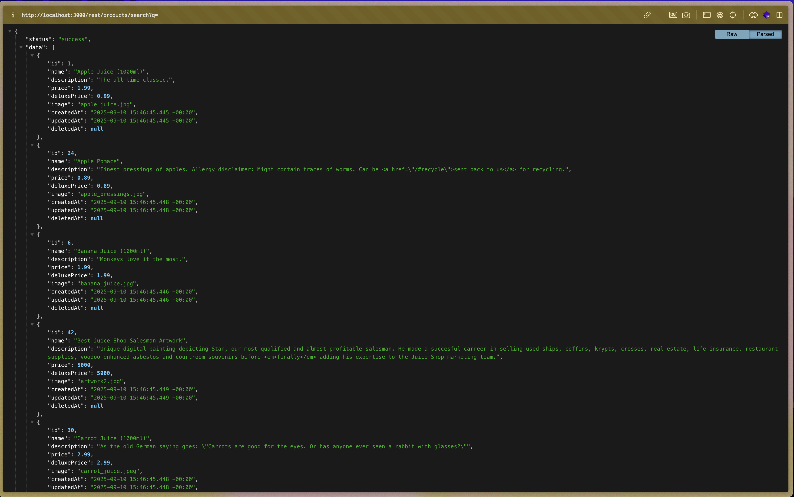
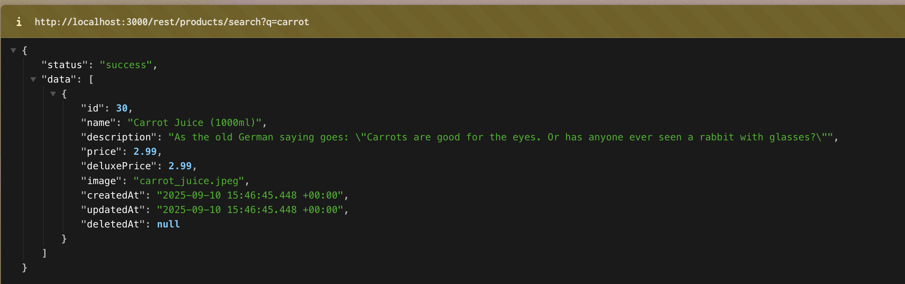
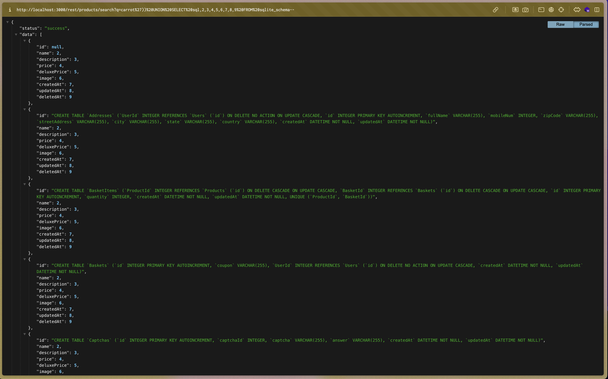
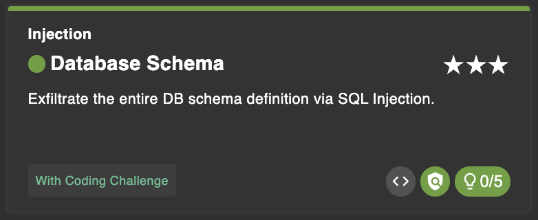

# Database Schema

Exfiltrate the entire DB schema definition via SQL Injection.

## Steps

1. periksa fitur pencarian produk. Namun, URL di browser `#/search?q=...` ternyata tidak benar-benar mengirimkan request ke backend. Setelah itu, saya menganalisis request yang dilakukan aplikasi dan menemukan endpoint backend sebenarnya yaitu `/rest/products/search?q=`, yang digunakan untuk mengambil data produk. Dari sini, terlihat jelas bahwa parameter q dapat di inject untuk melakukan SQL Injection.

2. Selanjutnya, saya akses endpoint backend tersebut di `http://localhost:3000/rest/products/search?q=` dan mendapat json ini. Saya juga coba untuk mencari salah satu produk yang tersedia di database
   

   `https://localhost:3000/rest/products/search?q=carrot`

   

3. Setelah itu, saya mencoba menambahkan payload untuk mendapatkan informasi lebih. melihat setiap produk ada 9 kolom jadi saya juga menambahkan hal tsb ke payload.

