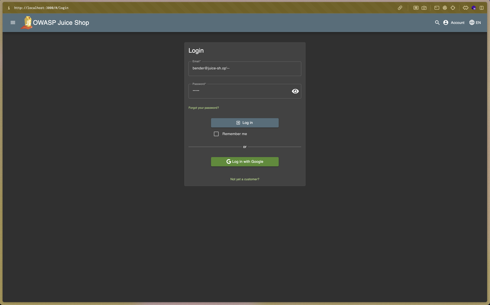
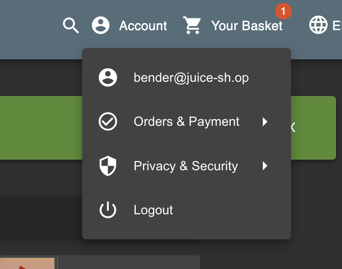

# Login Bender

Log in with the bender's user account.

## Reference

- https://github.com/payloadbox/sql-injection-payload-list
- https://github.com/swisskyrepo/PayloadsAllTheThings/tree/master/SQL%20Injection

## Steps

1. diminta untuk login sebagai user `bender` yang dimana kita akan mencoba cari data dari bender di website tersebut. Pada website ini ada tampilan product atau catalog yang berisi review" dari user.

kita temukan data email dari user `bender` pada page catalog. Email `bender@juice-sh.op` akan kita coba masukkan payload.

2. Berdasarkan referensi ada banyak opsi payload yang digunakan. Saya menggunakan `bender@juice-sh.op'--` lalu passwordnya bebas.

.

3. Hasilnya adalah kita dapat masuk sebagai user `bender` disini.

