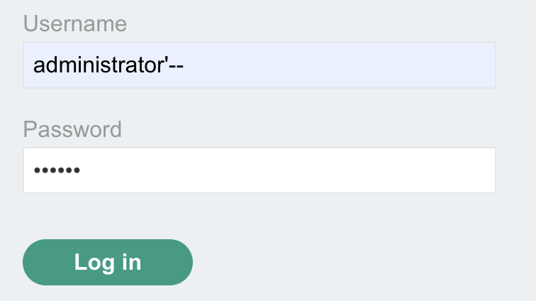
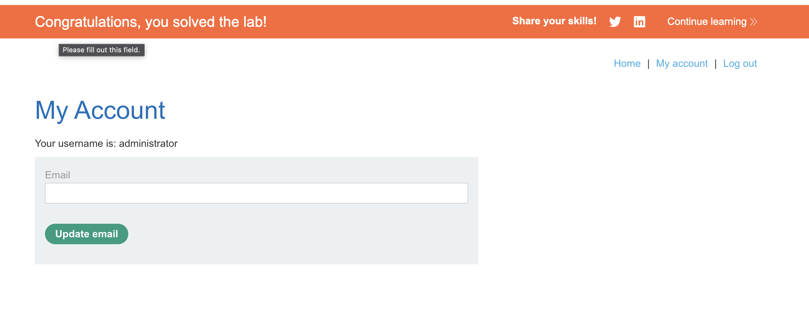

# Lab: SQL injection vulnerability allowing login bypass(PortSwigger)

This lab contains a SQL injection vulnerability in the login function.

To solve the lab, perform a SQL injection attack that logs in to the application as the administrator user.

## Steps

1. Akses labnya.
   

2. Modif parameter `username` dengan `administrator'--`
   
   
