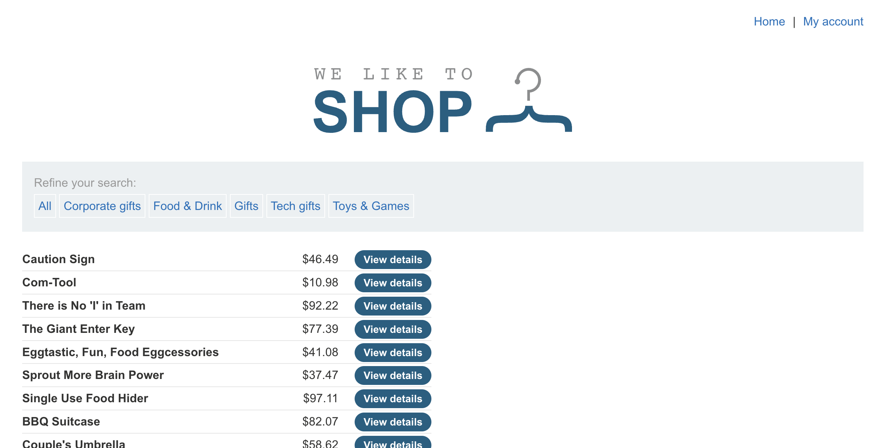
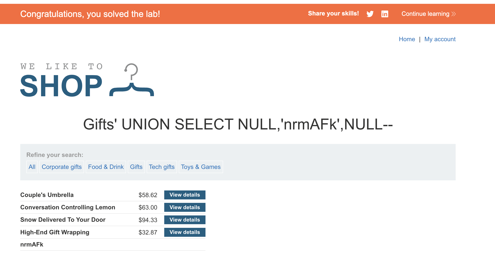

# Lab: SQL injection UNION attack, finding a column containing text

This lab contains a SQL injection vulnerability in the product category filter. The results from the query are returned in the application's response, so you can use a UNION attack to retrieve data from other tables. To construct such an attack, you first need to determine the number of columns returned by the query. You can do this using a technique you learned in a previous lab. The next step is to identify a column that is compatible with string data.

The lab will provide a random value that you need to make appear within the query results. To solve the lab, perform a SQL injection UNION attack that returns an additional row containing the value provided. This technique helps you determine which columns are compatible with string data.

## Steps

1. Setelah mengakses lab nya akan didapat landing page seperti ini:

2. Sesuai intruksi soal kita akan menggunakan UNION untuk mencari kolom yang memiliki text yang ditarget. Caranya adalah buka salah satu category yang tersedia, misal "Gifts" maka url nya adalah:

`https://0af40054041432d68066c6e00089006c.web-security-academy.net/filter?category=Gifts`

oleh karena itu kita perlu tambahkan payload ini

**`'+UNION+SELECT+NULL,'nrmAFk',NULL--`**

awalnya yang saya lakukan adalah

`'+UNION+SELECT+'nrmAFk',NULL,NULL--`

namun, payload tersebut gagal jadi saya ubah menjadi yang pertama.

