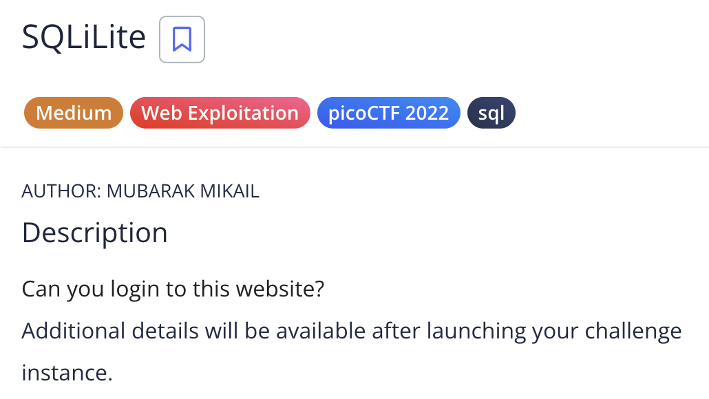
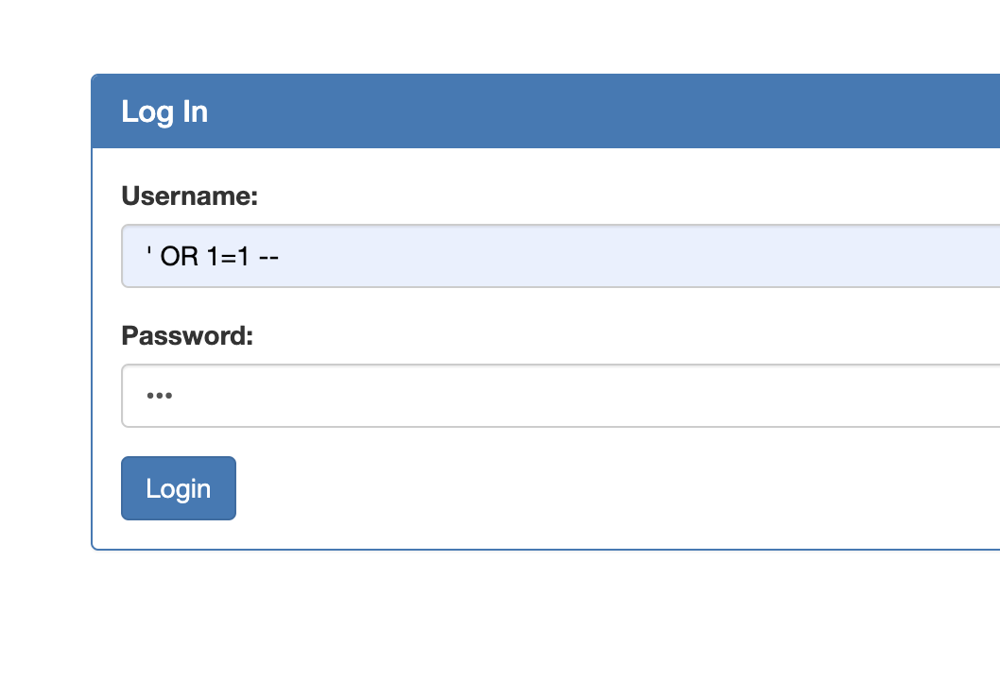
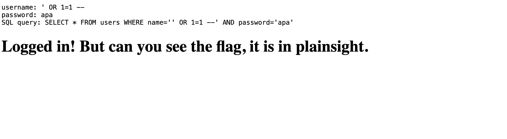

# SQLiLite (picoCTF)

## Reference

- https://github.com/payloadbox/sql-injection-payload-list
- https://github.com/swisskyrepo/PayloadsAllTheThings/tree/master/SQL%20Injection

## Steps

1. Launch instance terlebih dahulu, ketika dibuka muncul login page. Saya mencoba inject dengan beberapa payload. Disini saya menggunakan `' OR 1=1 --` dengan password bebas.

2. Setelah itu, tinggal inspect di source code dan flagnya ada di tag hidden.

